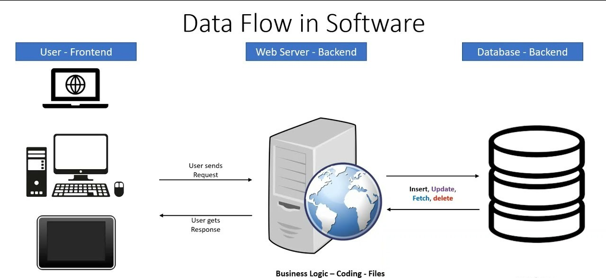

# Web Development Basics with Contact Us Form

## What is Web Development?

Web development refers to the process of building and maintaining websites or web applications. It involves two major parts:

- **Frontend Development**: The part of the website that users interact with directly (User Interface).
- **Backend Development**: The server-side logic and database management that handle requests and responses.

A typical web application flow looks like this:

### How Data Flows in Web Development



---

## Frontend Code Explanation

The frontend part of the project is built using **HTML, CSS, and JavaScript**.

### Code Explanation

**HTML Code:**

```html
<!DOCTYPE html>
<html lang="en">
<head>
    <meta charset="UTF-8">
    <meta name="viewport" content="width=device-width, initial-scale=1.0">
    <title>Contact Us</title>
    <link href="https://fonts.googleapis.com/css2?family=Poppins&display=swap" rel="stylesheet">
</head>
<body>
<div class="container">
    <h1>Contact Us</h1>
    <p>We would love to hear from you!</p>

    <form id="contactForm">
        <label>Name:</label>
        <input type="text" id="name" required>

        <label>Email:</label>
        <input type="email" id="email" required>

        <label>Number:</label>
        <input type="text" id="number" required>

        <label>Query:</label>
        <textarea id="query" required></textarea>

        <button type="submit">Submit</button>
    </form>
    <div id="responseMessage"></div>
</div>
</body>
</html>
```

**Functionality:**

- This code creates a contact form with fields for name, email, number, and query.
- The form is validated using the `required` attribute.

### JavaScript Code (Frontend Interaction):

```js
<script>
document.getElementById("contactForm").addEventListener("submit", async function(e) {
    e.preventDefault();

    const data = {
        name: document.getElementById("name").value,
        email: document.getElementById("email").value,
        number: document.getElementById("number").value,
        query: document.getElementById("query").value
    };

    const response = await fetch("http://localhost:5000/submit", {
        method: "POST",
        headers: { "Content-Type": "application/json" },
        body: JSON.stringify(data)
    });

    const result = await response.json();
    document.getElementById("responseMessage").innerHTML = result.message;
});
</script>
```

**Functionality:**

- This code listens for the form submission event.
- It sends form data to the backend API using **fetch API** in JSON format.

---

## Backend Code Explanation

Backend is developed using **Node.js, Express.js, and MongoDB**.

### Dependencies

Install the required packages:

```bash
npm install express mongoose cors body-parser dotenv
```

### Model (MongoDB Schema)

**model.js**

```js
const mongoose = require("mongoose");

const formSchema = new mongoose.Schema({
    name: String,
    email: String,
    number: String,
    query: String
});

module.exports = mongoose.model("Form", formSchema);
```

### Server Setup

**server.js**

```js
const express = require("express");
const mongoose = require("mongoose");
const Form = require("./model");
const cors = require("cors");
const bodyParser = require("body-parser");
require("dotenv").config();

const app = express();
app.use(cors());
app.use(bodyParser.json());

mongoose.connect(process.env.MONGO_URI)
    .then(() => console.log("MongoDB Connected"))
    .catch(err => console.log(err));

app.post("/submit", async (req, res) => {
    const form = new Form(req.body);
    try {
        await form.save();
        res.status(200).json({ message: "Data Submitted Successfully" });
    } catch (err) {
        res.status(400).json({ message: "Failed to Submit Data" });
    }
});

app.listen(5000, () => console.log("Server running on port 5000"));
```

---

## How It Works Together

1. The **frontend** collects user input from the form.
2. The input data is sent to the **backend API** using `fetch()`.
3. The backend API stores the data into the **MongoDB database**.
4. A success or error message is returned to the frontend.

---


